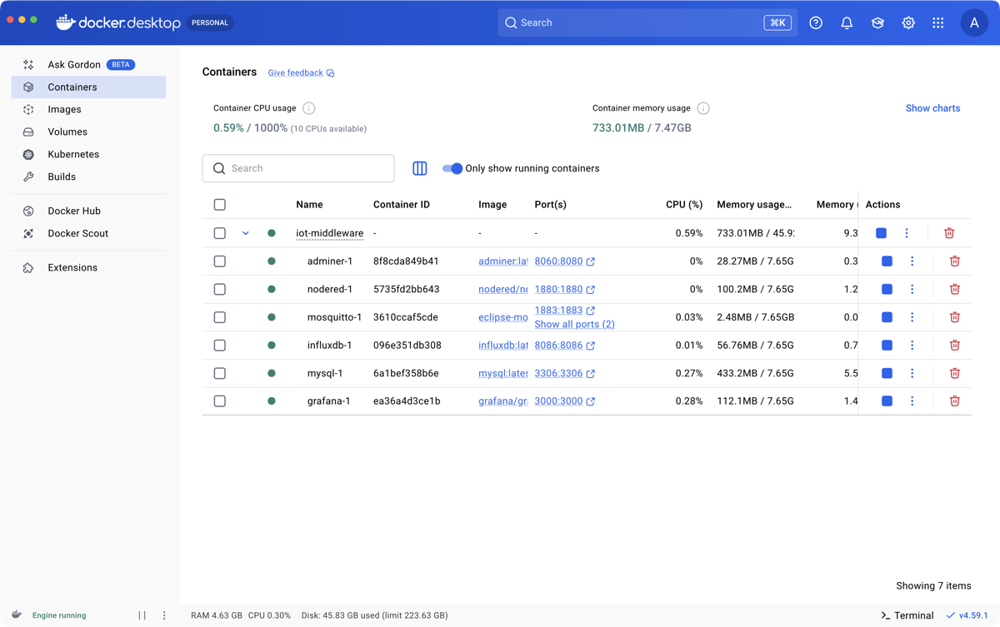
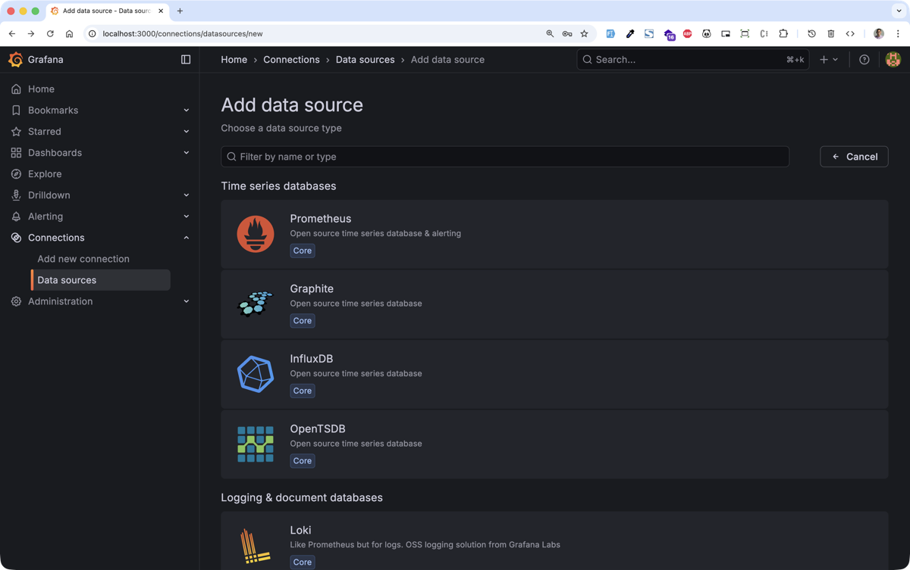

Thanks to ai.iot.education.solutions.marketplace ==================================================

Ts. Mohamad Ariffin Zulkifli
ariffin@myduino.com

as an original owner of this repository. https://github.com/ariffinzulkifli/iot-middleware

This repository is a training platform on how to setup docker compose to PC.

This repository will be upgrade from time to time


## Directory layout

* `docker-compose.yml`: the docker-compose file containing the services
* `configuration/mosquitto`: directory containing the Mosquitto (MQTT broker) configuration
* `configuration/nodered`: directory containing the Node-RED configuration

## Installation

**Prerequisites:** [Git](https://git-scm.com/) must be installed on your system.

Choose the installation guide that matches your platform:

- [Option 1: PC or Mac (Docker Desktop)](#option-1-pc-or-mac-docker-desktop)


### Option 1: PC or Mac (Docker Desktop)

1. Download and install [Docker Desktop](https://www.docker.com/products/docker-desktop/) for your operating system (Windows or Mac).

2. Make sure Docker Desktop is running.

3. Open Terminal (Mac) or PowerShell (Windows) and clone this repository.
```bash
git clone https://github.com/cikdet/ADAM6717_TestRepo.git
```

4. Change your working directory to the cloned repository directory.
```bash
cd ADAM6717_TestRepo
```

5. Launch the Docker Compose services in detached mode.
```bash
docker compose up -d
```
Wait until all containers is successfully `Created` like below.

```
[+] up 84/84
 ✔ Image eclipse-mosquitto:latest       Pulled                                                13.3s
 ✔ Image adminer:latest                 Pulled                                                25.5s
 ✔ Image nodered/node-red:latest        Pulled                                                45.0s
 ✔ Image influxdb:latest                Pulled                                                34.4s
 ✔ Image grafana/grafana:latest         Pulled                                                47.9s
 ✔ Image mysql:latest                   Pulled                                                50.3s
 ✔ Network iot-middleware_iotstack      Created                                                0.0s
 ✔ Container ADAM6717_TestRepo-grafana-1   Created                                                0.5s
 ✔ Container ADAM6717_TestRepo-adminer-1   Created                                                0.5s
 ✔ Container ADAM6717_TestRepo-influxdb-1  Created                                                0.5s
 ✔ Container ADAM6717_TestRepo-mosquitto-1 Created                                                0.5s
 ✔ Container ADAM6717_TestRepo-mysql-1     Created                                                0.5s
 ✔ Container ADAM6717_TestRepo-nodered-1   Created                                                0.5s
```

6. Verify the containers are running in Docker Desktop.



7. Access the services by clicking on the port link in Docker Desktop or open your browser and navigate to the service URL.

7.1 Node-RED http://localhost:1880 (username: `admin`, password: `password`)


7.2 InfluxDB http://localhost:8086 (username: `admin`, password: `password`)


7.3 Grafana http://localhost:3000 (username: `admin`, password: `password`)



7.4 Adminer http://localhost:8060 (username: `root`, password: `password`)


You can also verify the containers using command like below:
```bash
docker compose ps
```

```
NAME                         IMAGE                      COMMAND                  SERVICE     CREATED          STATUS                    PORTS
ADAM6717_TestRepo-adminer-1     adminer:latest             "entrypoint.sh docke…"   adminer     16 seconds ago   Up 15 seconds             0.0.0.0:8060->8080/tcp
ADAM6717_TestRepo-grafana-1     grafana/grafana:latest     "/run.sh"                grafana     16 seconds ago   Up 15 seconds             0.0.0.0:3000->3000/tcp
ADAM6717_TestRepo-influxdb-1    influxdb:latest            "/entrypoint.sh infl…"   influxdb    16 seconds ago   Up 15 seconds (healthy)   0.0.0.0:8086->8086/tcp
ADAM6717_TestRepo-mosquitto-1   eclipse-mosquitto:latest   "/docker-entrypoint.…"   mosquitto   16 seconds ago   Up 15 seconds             0.0.0.0:1883->1883/tcp, 0.0.0.0:9001->9001/tcp
ADAM6717_TestRepo-mysql-1       mysql:latest               "docker-entrypoint.s…"   mysql       16 seconds ago   Up 15 seconds             0.0.0.0:3306->3306/tcp
ADAM6717_TestRepo-nodered-1     nodered/node-red:latest    "./entrypoint.sh"        nodered     16 seconds ago   Up 15 seconds (healthy)   0.0.0.0:1880->1880/tcp
```

```bash
docker compose logs
```

